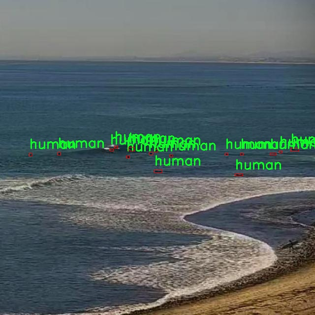
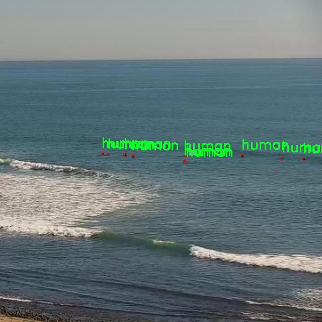

# 改进yolo11-SCConv等200+全套创新点大全：冲浪者检测系统源码＆数据集全套

### 1.图片效果展示


##### 项目来源 **[人工智能促进会 2024.11.03](https://kdocs.cn/l/cszuIiCKVNis)**

注意：由于项目一直在更新迭代，上面“1.图片效果展示”和“2.视频效果展示”展示的系统图片或者视频可能为老版本，新版本在老版本的基础上升级如下：（实际效果以升级的新版本为准）

  （1）适配了YOLOV11的“目标检测”模型和“实例分割”模型，通过加载相应的权重（.pt）文件即可自适应加载模型。

  （2）支持“图片识别”、“视频识别”、“摄像头实时识别”三种识别模式。

  （3）支持“图片识别”、“视频识别”、“摄像头实时识别”三种识别结果保存导出，解决手动导出（容易卡顿出现爆内存）存在的问题，识别完自动保存结果并导出到tempDir中。

  （4）支持Web前端系统中的标题、背景图等自定义修改。

  另外本项目提供训练的数据集和训练教程,暂不提供权重文件（best.pt）,需要您按照教程进行训练后实现图片演示和Web前端界面演示的效果。

### 2.视频效果展示

[2.1 视频效果展示](https://www.bilibili.com/video/BV1tuDJYKEYv/)

### 3.背景

研究背景与意义

随着冲浪运动的普及，越来越多的冲浪者涌向海滩，带来了丰富的海洋文化和经济效益。然而，冲浪者的安全问题也日益凸显，尤其是在波浪变化和天气条件不稳定的情况下，冲浪者的监测与救援显得尤为重要。因此，开发一个高效的冲浪者检测系统，不仅能够提高冲浪者的安全性，还能为海洋管理和救援工作提供技术支持。

本研究基于改进的YOLOv11模型，旨在构建一个高效的冲浪者检测系统。YOLO（You Only Look Once）系列模型以其实时性和高准确率而广受欢迎，适合于动态场景下的目标检测。通过对YOLOv11的改进，我们期望在提高检测精度的同时，缩短检测时间，以适应海洋环境中快速变化的条件。

在本项目中，我们使用的冲浪者数据集包含8200张图像，所有图像均标注为“人”类。这一数据集为模型的训练和验证提供了丰富的样本，有助于提升模型在实际应用中的泛化能力。通过对冲浪者的准确检测，我们能够及时识别出处于危险中的冲浪者，并为救援人员提供准确的信息，从而提高救援效率。

此外，本研究还将探讨在不同光照、天气和海浪条件下，模型的表现和适应性。这将为未来的冲浪者监测系统提供重要的理论基础和实践指导，推动海洋安全技术的发展。通过这一项目，我们希望为冲浪者的安全保障提供切实可行的解决方案，同时为相关领域的研究提供新的视角和思路。

### 4.数据集信息展示

##### 4.1 本项目数据集详细数据（类别数＆类别名）

nc: 1
names: ['human']


该项目为【目标检测】数据集，请在【训练教程和Web端加载模型教程（第三步）】这一步的时候按照【目标检测】部分的教程来训练

##### 4.2 本项目数据集信息介绍

本项目数据集信息介绍

本项目所使用的数据集名为“surfer”，旨在为改进YOLOv11的冲浪者检测系统提供强有力的支持。该数据集专注于冲浪者的检测，包含了丰富的图像数据，旨在提升模型在复杂环境下的识别能力。数据集中包含的类别数量为1，类别列表仅包含“human”，这表明该数据集主要聚焦于冲浪者这一特定目标。通过专注于单一类别，我们能够在数据标注和模型训练过程中，确保高质量的样本选择和标注精度，从而提高模型的检测准确性。

“surfer”数据集中的图像均经过精心挑选，涵盖了多种冲浪场景，包括不同的天气条件、光照变化以及海浪状态。这种多样性不仅增强了数据集的代表性，也为模型在实际应用中的鲁棒性提供了保障。此外，数据集中的图像均进行了标注，确保每一位冲浪者的位置信息清晰可见，便于YOLOv11模型进行有效的训练和测试。

在训练过程中，数据集将被分为训练集和验证集，以便对模型的性能进行全面评估。通过对“surfer”数据集的深入分析和应用，我们期望能够显著提升YOLOv11在冲浪者检测任务中的表现，使其在实际场景中能够快速、准确地识别冲浪者。这不仅对冲浪运动的安全监测具有重要意义，也为未来的智能监控系统奠定了基础。总之，“surfer”数据集为本项目提供了坚实的数据支持，助力我们在冲浪者检测领域的研究与应用。







### 5.全套项目环境部署视频教程（零基础手把手教学）

[5.1 所需软件PyCharm和Anaconda安装教程（第一步）](https://www.bilibili.com/video/BV1BoC1YCEKi/?spm_id_from=333.999.0.0&vd_source=bc9aec86d164b67a7004b996143742dc)


[5.2 安装Python虚拟环境创建和依赖库安装视频教程（第二步）](https://www.bilibili.com/video/BV1ZoC1YCEBw?spm_id_from=333.788.videopod.sections&vd_source=bc9aec86d164b67a7004b996143742dc)

### 6.改进YOLOv11训练教程和Web_UI前端加载模型教程（零基础手把手教学）

[6.1 改进YOLOv11训练教程和Web_UI前端加载模型教程（第三步）](https://www.bilibili.com/video/BV1BoC1YCEhR?spm_id_from=333.788.videopod.sections&vd_source=bc9aec86d164b67a7004b996143742dc)


按照上面的训练视频教程链接加载项目提供的数据集，运行train.py即可开始训练



     Epoch   gpu_mem       box       obj       cls    labels  img_size
     1/200     20.8G   0.01576   0.01955  0.007536        22      1280: 100%|██████████| 849/849 [14:42<00:00,  1.04s/it]
               Class     Images     Labels          P          R     mAP@.5 mAP@.5:.95: 100%|██████████| 213/213 [01:14<00:00,  2.87it/s]
                 all       3395      17314      0.994      0.957      0.0957      0.0843

     Epoch   gpu_mem       box       obj       cls    labels  img_size
     2/200     20.8G   0.01578   0.01923  0.007006        22      1280: 100%|██████████| 849/849 [14:44<00:00,  1.04s/it]
               Class     Images     Labels          P          R     mAP@.5 mAP@.5:.95: 100%|██████████| 213/213 [01:12<00:00,  2.95it/s]
                 all       3395      17314      0.996      0.956      0.0957      0.0845

     Epoch   gpu_mem       box       obj       cls    labels  img_size
     3/200     20.8G   0.01561    0.0191  0.006895        27      1280: 100%|██████████| 849/849 [10:56<00:00,  1.29it/s]
               Class     Images     Labels          P          R     mAP@.5 mAP@.5:.95: 100%|███████   | 187/213 [00:52<00:00,  4.04it/s]
                 all       3395      17314      0.996      0.957      0.0957      0.0845


###### [项目数据集下载链接](https://kdocs.cn/l/cszuIiCKVNis)

### 7.原始YOLOv11算法讲解

YOLOv11是一种由Ultralytics公司开发的最新一代目标检测模型，以其增强的特征提取能力和更高的效率在计算机视觉领域引人注目。该模型在架构上进行了关键升级，通过更新主干和颈部结构，显著提高了对复杂视觉场景的理解和处理精度。YOLOv11不仅在目标检测上表现出色，还支持实例分割、图像分类、姿态估计和定向目标检测（OBB）等任务，展示出其多功能性。

与其前身YOLOv8相比，YOLOv11在设计上实现了深度和宽度的改变，同时引入了几个创新机制。其中，C3k2机制是对YOLOv8中的C2f的改进，提升了浅层特征的处理能力；C2PSA机制则进一步优化了特征图的处理流程。解耦头的创新设计，通过增加两个深度卷积（DWConv），提高了模型对细节的感知能力和分类准确性。

在性能上，YOLOv11m模型在COCO数据集上的平均精度（mAP）提高，并减少了22%的参数量，确保了在运算效率上的突破。该模型可以部署在多种平台上，包括边缘设备、云平台以及支持NVIDIA GPU的系统，彰显出卓越的灵活性和适应性。总体而言，YOLOv11通过一系列的创新突破，对目标检测领域产生了深远的影响，并为未来的开发提供了新的研究方向。


****文档**** ： _ _https://docs.ultralytics.com/models/yolo11/__

****代码链接**** ： _ _https://github.com/ultralytics/ultralytics__

******Performance Metrics******


​ ** **关键特性****

****◆**** ** **增强的特征提取能力**** ：YOLO11采用了改进的主干和颈部架构，增强了 ** **特征提取****
能力，能够实现更精确的目标检测和复杂任务的执行。

****◆**** ** **优化的效率和速度****
：YOLO11引入了精细化的架构设计和优化的训练流程，提供更快的处理速度，并在准确性和性能之间保持最佳平衡。

****◆**** ** **参数更少、精度更高****
：通过模型设计的改进，YOLO11m在COCO数据集上实现了更高的平均精度（mAP），同时使用的参数比YOLOv8m少22%，使其在计算上更加高效，而不牺牲准确性。

****◆**** ** **跨环境的适应性**** ：YOLO11可以无缝部署在各种环境中，包括边缘设备、云平台和支持NVIDIA
GPU的系统，确保最大的灵活性。

****◆**** ** **支持广泛任务****
：无论是目标检测、实例分割、图像分类、姿态估计还是定向目标检测（OBB），YOLO11都旨在应对一系列计算机视觉挑战。

****支持的任务和模式****


​YOLO11建立在YOLOv8中引入的多功能模型范围之上，为各种计算机视觉任务提供增强的支持:


​该表提供了YOLO11模型变体的概述，展示了它们在特定任务中的适用性以及与Inference、Validation、Training和Export等操作模式的兼容性。从实时检测到复杂的分割任务
，这种灵活性使YOLO11适用于计算机视觉的广泛应用。

##### yolov11的创新

■ yolov8 VS yolov11

YOLOv5，YOLOv8和YOLOv11均是ultralytics公司的作品，ultralytics出品必属精品。


​ **具体创新点** ：

**① 深度（depth）和宽度 （width）**

YOLOv8和YOLOv11是基本上完全不同。

**② C3k2机制**

C3k2有参数为c3k，其中在网络的浅层c3k设置为False。C3k2就相当于YOLOv8中的C2f。


​ **③ C2PSA机制**

下图为C2PSA机制的原理图。


​ **④ 解耦头**

解耦头中的分类检测头增加了两个 **DWConv** 。


▲Conv

    
    
    def autopad(k, p=None, d=1):  # kernel, padding, dilation
    
        """Pad to 'same' shape outputs."""
    
        if d > 1:
    
            k = d * (k - 1) + 1 if isinstance(k, int) else [d * (x - 1) + 1 for x in k]  # actual kernel-size
    
        if p is None:
    
            p = k // 2 if isinstance(k, int) else [x // 2 for x in k]  # auto-pad
    
    return p
    
    
    class Conv(nn.Module):
    
        """Standard convolution with args(ch_in, ch_out, kernel, stride, padding, groups, dilation, activation)."""
    
    
        default_act = nn.SiLU()  # default activation
    
    
        def __init__(self, c1, c2, k=1, s=1, p=None, g=1, d=1, act=True):
    
            """Initialize Conv layer with given arguments including activation."""
    
            super().__init__()
    
            self.conv = nn.Conv2d(c1, c2, k, s, autopad(k, p, d), groups=g, dilation=d, bias=False)
    
            self.bn = nn.BatchNorm2d(c2)
    
            self.act = self.default_act if act is True else act if isinstance(act, nn.Module) else nn.Identity()
    
    
        def forward(self, x):
    
            """Apply convolution, batch normalization and activation to input tensor."""
    
            return self.act(self.bn(self.conv(x)))
    
    
        def forward_fuse(self, x):
    
            """Perform transposed convolution of 2D data."""
    
            return self.act(self.conv(x))

▲Conv2d

    
    
    torch.nn.Conv2d(in_channels, out_channels, kernel_size, stride=1, padding=0, dilation=1, groups=1, bias=True, padding_mode='zeros')

▲DWConv

DWConv ** **代表 Depthwise Convolution（深度卷积）****
，是一种在卷积神经网络中常用的高效卷积操作。它主要用于减少计算复杂度和参数量。

    
    
    class DWConv(Conv):
    
        """Depth-wise convolution."""
    
    
        def __init__(self, c1, c2, k=1, s=1, d=1, act=True):  # ch_in, ch_out, kernel, stride, dilation, activation
    
            """Initialize Depth-wise convolution with given parameters."""
    
            super().__init__(c1, c2, k, s, g=math.gcd(c1, c2), d=d, act=act)


### 8.200+种全套改进YOLOV11创新点原理讲解

#### 8.1 200+种全套改进YOLOV11创新点原理讲解大全

由于篇幅限制，每个创新点的具体原理讲解就不全部展开，具体见下列网址中的改进模块对应项目的技术原理博客网址【Blog】（创新点均为模块化搭建，原理适配YOLOv5~YOLOv11等各种版本）

[改进模块技术原理博客【Blog】网址链接](https://gitee.com/qunmasj/good)


#### 8.2 精选部分改进YOLOV11创新点原理讲解

###### 这里节选部分改进创新点展开原理讲解(完整的改进原理见上图和[改进模块技术原理博客链接](https://gitee.com/qunmasj/good)【如果此小节的图加载失败可以通过CSDN或者Github搜索该博客的标题访问原始博客，原始博客图片显示正常】


### Context_Grided_Network(CGNet)简介
参考该博客提出的一种轻量化语义分割模型Context Grided Network(CGNet)，以满足设备的运行需要。

CGNet主要由CG块构建而成，CG块可以学习局部特征和周围环境上下文的联合特征，最后通过引入全局上下文特征进一步改善联合特征的学习。


 
下图给出了在Cityscapes数据集上对现有的一些语义分割模型的测试效果，横轴表示参数量，纵轴表示准确率(mIoU)。可以看出，在参数量较少的情况下，CGNet可以达到一个比较好的准确率。虽与高精度模型相去甚远，但在一些对精度要求不高、对实时性要求比较苛刻的情况下，很有价值。


高精度模型，如DeepLab、DFN、DenseASPP等，动不动就是几十M的参数，很难应用在移动设备上。而上图中红色的模型，相对内存占用较小，但它们的分割精度却不是很高。作者认为主要原因是，这些小网络大多遵循着分类网络的设计思路，并没有考虑语义分割任务更深层次的特点。

空间依赖性和上下文信息对提高分割精度有很大的作用。作者从该角度出发，提出了CG block，并进一步搭建了轻量级语义分割网络CGNet。CG块具有以下特点： 

学习局部特征和上下文特征的联合特征；
通过全局上下文特征改进上述联合特征；
可以贯穿应用在整个网络中，从low level（空间级别）到high level（语义级别）。不像PSPNet、DFN、DenseASPP等，只在编码阶段以后捕捉上下文特征。；
只有3个下采样，相比一般5个下采样的网络，能够更好地保留边缘信息。
CGNet遵循“深而薄”的原则设计，整个网络又51层构成。其中，为了降低计算，大量使用了channel-wise conv.

小型语义分割模型：

需要平衡准确率和系统开销
进化路线：ENet -> ICNet -> ESPNet
这些模型基本都基于分类网络设计，在分割准确率上效果并不是很好
上下文信息模型：

大多数现有模型只考虑解码阶段的上下文信息并且没有利用周围的上下文信息
注意力机制：

CG block使用全局上下文信息计算权重向量，并使用其细化局部特征和周围上下文特征的联合特征

#### Context Guided Block
CG block由4部分组成：


此外，CG block还采用了残差学习。文中提出了局部残差学习（LRL）和全局残差学习（GRL）两种方式。 LRL添加了从输入到联合特征提取器的连接，GRL添加了从输入到全局特征提取器的连接。从直观上来说，GRL比LRL更能促进网络中的信息传递（更像ResNet~~），后面实验部分也进行了测试，的确GRL更能提升分割精度。


CGNet的通用网络结构如下图所示，分为3个stage，第一个stage使用3个卷积层抽取特征，第二和第三个stage堆叠一定数量的CG block，具体个数可以根据情况调整。最后，通过1x1 conv得到分割结果。


下图是用于Cityscapes数据集的CGNet网络细节说明：输入尺寸为3*680*680；stage1连续使用了3个Conv-BN-PReLU组合，首个组合使用了stride=2的卷积，所以得到了1/2分辨率的feature map；stage2和stage3分别使用了多个CG block，且其中使用了不同大小的膨胀卷积核，最终分别得到了1/4和1/8的feature map。

需注意：

stage2&3的输入特征分别由其上一个stage的首个和最后一个block组合给出（参考上图的绿色箭头）；

输入注入机制，图中未体现，实际使用中，作者还将输入图像下采样1/4或1/8，分别给到stage2和stage3的输入中 ，以进一步加强特征传递。

channel-wise conv。为了缩减参数数量，在局部特征提取器和周围上下文特征提取器中使用了channel-wise卷积，可以消除跨通道的计算成本，同时节省内存占用。但是，没有像MobileNet等模型一样，在depth-wise卷积后面接point-wise卷积（1*1 conv），作者解释是，因为CG block需要保持局部特征和周围上下文特征的独立性，而1*1 conv会破坏这种独立性，所以效果欠佳，实验部分也进行了验证。

个人感觉此处应该指的是depth-wise卷积？

官方Git中对该部分的实现如下：


### 9.系统功能展示

图9.1.系统支持检测结果表格显示

  图9.2.系统支持置信度和IOU阈值手动调节

  图9.3.系统支持自定义加载权重文件best.pt(需要你通过步骤5中训练获得)

  图9.4.系统支持摄像头实时识别

  图9.5.系统支持图片识别

  图9.6.系统支持视频识别

  图9.7.系统支持识别结果文件自动保存

  图9.8.系统支持Excel导出检测结果数据


### 10. YOLOv11核心改进源码讲解

#### 10.1 FreqFusion.py

以下是对代码中最核心部分的提取和详细中文注释：

```python
import torch
import torch.nn as nn
import torch.nn.functional as F

class FreqFusion(nn.Module):
    def __init__(self, channels, scale_factor=1, lowpass_kernel=5, highpass_kernel=3, **kwargs):
        super().__init__()
        hr_channels, lr_channels = channels
        self.scale_factor = scale_factor
        self.lowpass_kernel = lowpass_kernel
        self.highpass_kernel = highpass_kernel
        
        # 压缩高分辨率和低分辨率特征通道
        self.compressed_channels = (hr_channels + lr_channels) // 8
        self.hr_channel_compressor = nn.Conv2d(hr_channels, self.compressed_channels, 1)
        self.lr_channel_compressor = nn.Conv2d(lr_channels, self.compressed_channels, 1)
        
        # 内容编码器，用于生成低通滤波器
        self.content_encoder = nn.Conv2d(
            self.compressed_channels,
            lowpass_kernel ** 2 * scale_factor * scale_factor,
            kernel_size=3,
            padding=1
        )
        
        # 高通滤波器编码器
        self.content_encoder2 = nn.Conv2d(
            self.compressed_channels,
            highpass_kernel ** 2 * scale_factor * scale_factor,
            kernel_size=3,
            padding=1
        )

    def kernel_normalizer(self, mask, kernel):
        """
        对生成的掩码进行归一化处理
        """
        n, mask_c, h, w = mask.size()
        mask_channel = int(mask_c / float(kernel**2))
        
        # 重新调整掩码形状并进行softmax归一化
        mask = mask.view(n, mask_channel, -1, h, w)
        mask = F.softmax(mask, dim=2)
        mask = mask.view(n, mask_channel, kernel, kernel, h, w)
        mask = mask.permute(0, 1, 4, 5, 2, 3).view(n, -1, kernel, kernel)
        
        # 归一化处理
        mask /= mask.sum(dim=(-1, -2), keepdims=True)
        return mask

    def forward(self, x):
        """
        前向传播函数
        """
        hr_feat, lr_feat = x
        
        # 压缩高分辨率和低分辨率特征
        compressed_hr_feat = self.hr_channel_compressor(hr_feat)
        compressed_lr_feat = self.lr_channel_compressor(lr_feat)
        
        # 生成低通和高通掩码
        mask_lr = self.content_encoder(compressed_hr_feat)
        mask_hr = self.content_encoder2(compressed_hr_feat)
        
        # 归一化掩码
        mask_lr = self.kernel_normalizer(mask_lr, self.lowpass_kernel)
        mask_hr = self.kernel_normalizer(mask_hr, self.highpass_kernel)
        
        # 使用低通掩码对低分辨率特征进行上采样
        lr_feat = F.interpolate(lr_feat, scale_factor=self.scale_factor, mode='bilinear', align_corners=False)
        lr_feat = F.conv2d(lr_feat, mask_lr)  # 应用低通掩码
        
        # 使用高通掩码对高分辨率特征进行处理
        hr_feat = hr_feat - F.conv2d(hr_feat, mask_hr)  # 高频残差
        
        return hr_feat + lr_feat  # 返回融合后的特征

# 计算相似度的函数
def compute_similarity(input_tensor, k=3):
    """
    计算输入张量中每一点与周围KxK范围内的点的余弦相似度。
    """
    B, C, H, W = input_tensor.shape
    unfold_tensor = F.unfold(input_tensor, k, padding=(k // 2))
    unfold_tensor = unfold_tensor.reshape(B, C, k**2, H, W)
    
    # 计算余弦相似度
    similarity = F.cosine_similarity(unfold_tensor[:, :, k * k // 2:k * k // 2 + 1], unfold_tensor[:, :, :], dim=1)
    similarity = similarity.view(B, k * k - 1, H, W)
    return similarity
```

### 代码核心部分分析：
1. **FreqFusion类**：该类是整个频率感知特征融合的核心，主要用于将高分辨率和低分辨率特征进行融合。它包含了特征压缩、低通和高通滤波器的生成以及掩码的归一化处理。

2. **kernel_normalizer方法**：用于对生成的掩码进行归一化，确保掩码的和为1，以便在后续的卷积操作中保持特征的相对权重。

3. **forward方法**：实现了前向传播的逻辑，主要步骤包括特征压缩、掩码生成、掩码归一化、低分辨率特征的上采样和高分辨率特征的高频残差计算，最终返回融合后的特征。

4. **compute_similarity函数**：用于计算输入张量中每一点与周围KxK范围内的点的余弦相似度，提供了特征之间的相似性度量，便于后续的特征融合。

这些核心部分共同构成了频率感知特征融合的基本框架，能够有效地将不同分辨率的特征进行融合，提升图像预测的精度。

这个程序文件 `FreqFusion.py` 实现了一种名为“频率感知特征融合”的深度学习模型，主要用于密集图像预测任务。它利用高频和低频特征的融合来提升图像的重建质量，尤其是在超分辨率和图像生成等应用中。

首先，文件导入了必要的库，包括 PyTorch 和一些功能模块。它定义了一些初始化函数，例如 `normal_init` 和 `constant_init`，用于初始化神经网络的权重和偏置。这些初始化方法确保网络在训练开始时有一个良好的起点，从而加速收敛。

接下来，文件中定义了一个 `resize` 函数，用于调整输入张量的大小。这个函数可以在进行特征融合时，确保特征图的尺寸匹配。

`hamming2D` 函数用于生成二维 Hamming 窗口，Hamming 窗口在信号处理和图像处理中常用于减少边缘效应。

`FreqFusion` 类是该文件的核心部分，继承自 `nn.Module`。在其构造函数中，定义了多个参数，如通道数、上采样因子、低通和高通卷积核大小等。该类的目的是通过不同的卷积层来压缩和编码高分辨率（HR）和低分辨率（LR）特征图。具体来说，它使用卷积层将输入特征图压缩到较小的通道数，并通过编码器生成低通和高通特征。

在 `FreqFusion` 类中，还定义了一个 `init_weights` 方法，用于初始化卷积层的权重。该方法使用 Xavier 初始化和正态分布初始化来确保模型的稳定性。

`kernel_normalizer` 方法用于对生成的掩码进行归一化处理，以确保其在后续操作中的有效性。该方法通过对掩码进行 softmax 操作来实现归一化。

`forward` 方法是模型的前向传播函数，它接收高分辨率和低分辨率特征图作为输入，并通过一系列卷积和上采样操作来生成融合后的特征图。如果启用了检查点功能，则会使用 PyTorch 的检查点机制来节省内存。

`_forward` 方法实现了具体的特征融合逻辑，包括对高频和低频特征的处理。根据不同的配置，模型可以选择使用高通和低通卷积来生成掩码，并通过 CARAFE（Content-Aware ReAssembly of FEatures）操作进行特征重建。

`LocalSimGuidedSampler` 类是一个辅助模块，用于生成偏移量以引导特征重采样。它使用局部相似性来计算偏移量，从而在特征融合过程中保持空间一致性。

最后，`compute_similarity` 函数用于计算输入张量中每个点与其周围点的余弦相似度，以帮助生成更准确的偏移量。

总体而言，这个文件实现了一个复杂的深度学习模型，专注于通过频率感知的方式融合特征，以提高图像预测的精度和质量。模型通过不同的卷积操作和特征重采样技术，能够有效地处理高分辨率和低分辨率特征，从而在图像生成和超分辨率等任务中表现出色。

#### 10.2 mamba_yolo.py

以下是经过简化并添加详细中文注释的核心代码部分：

```python
import torch
import torch.nn as nn
from einops import rearrange

class LayerNorm2d(nn.Module):
    """自定义的二维层归一化类"""
    
    def __init__(self, normalized_shape, eps=1e-6, elementwise_affine=True):
        super().__init__()
        # 初始化层归一化
        self.norm = nn.LayerNorm(normalized_shape, eps, elementwise_affine)

    def forward(self, x):
        # 将输入张量的形状从 (B, C, H, W) 转换为 (B, H, W, C)
        x = rearrange(x, 'b c h w -> b h w c').contiguous()
        # 应用层归一化
        x = self.norm(x)
        # 将张量形状转换回 (B, C, H, W)
        x = rearrange(x, 'b h w c -> b c h w').contiguous()
        return x


class CrossScan(torch.autograd.Function):
    """交叉扫描操作的自定义函数"""
    
    @staticmethod
    def forward(ctx, x: torch.Tensor):
        B, C, H, W = x.shape
        ctx.shape = (B, C, H, W)
        # 创建一个新的张量，用于存储交叉扫描的结果
        xs = x.new_empty((B, 4, C, H * W))
        xs[:, 0] = x.flatten(2, 3)  # 原始张量展平
        xs[:, 1] = x.transpose(dim0=2, dim1=3).flatten(2, 3)  # 转置后展平
        xs[:, 2:4] = torch.flip(xs[:, 0:2], dims=[-1])  # 反转前两个结果
        return xs

    @staticmethod
    def backward(ctx, ys: torch.Tensor):
        B, C, H, W = ctx.shape
        L = H * W
        # 计算反向传播的梯度
        ys = ys[:, 0:2] + ys[:, 2:4].flip(dims=[-1]).view(B, 2, -1, L)
        y = ys[:, 0] + ys[:, 1].view(B, -1, W, H).transpose(dim0=2, dim1=3).contiguous().view(B, -1, L)
        return y.view(B, -1, H, W)


class SelectiveScanCore(torch.autograd.Function):
    """选择性扫描操作的自定义函数"""
    
    @staticmethod
    @torch.cuda.amp.custom_fwd
    def forward(ctx, u, delta, A, B, C, D=None, delta_bias=None, delta_softplus=False, nrows=1, backnrows=1):
        # 确保输入张量是连续的
        if u.stride(-1) != 1:
            u = u.contiguous()
        if delta.stride(-1) != 1:
            delta = delta.contiguous()
        if D is not None and D.stride(-1) != 1:
            D = D.contiguous()
        if B.stride(-1) != 1:
            B = B.contiguous()
        if C.stride(-1) != 1:
            C = C.contiguous()
        
        # 处理维度
        if B.dim() == 3:
            B = B.unsqueeze(dim=1)
            ctx.squeeze_B = True
        if C.dim() == 3:
            C = C.unsqueeze(dim=1)
            ctx.squeeze_C = True
        
        # 进行选择性扫描的前向计算
        out, x, *rest = selective_scan_cuda_core.fwd(u, delta, A, B, C, D, delta_bias, delta_softplus, 1)
        ctx.save_for_backward(u, delta, A, B, C, D, delta_bias, x)
        return out

    @staticmethod
    @torch.cuda.amp.custom_bwd
    def backward(ctx, dout, *args):
        u, delta, A, B, C, D, delta_bias, x = ctx.saved_tensors
        if dout.stride(-1) != 1:
            dout = dout.contiguous()
        # 计算反向传播的梯度
        du, ddelta, dA, dB, dC, dD, ddelta_bias, *rest = selective_scan_cuda_core.bwd(
            u, delta, A, B, C, D, delta_bias, dout, x, ctx.delta_softplus, 1
        )
        return (du, ddelta, dA, dB, dC, dD, ddelta_bias, None, None, None, None)


class SS2D(nn.Module):
    """选择性扫描二维模块"""
    
    def __init__(self, d_model=96, d_state=16, ssm_ratio=2.0, act_layer=nn.SiLU, dropout=0.0):
        super().__init__()
        self.in_proj = nn.Conv2d(d_model, d_model * ssm_ratio, kernel_size=1, bias=False)
        self.act = act_layer()
        self.out_proj = nn.Conv2d(d_model * ssm_ratio, d_model, kernel_size=1, bias=False)
        self.dropout = nn.Dropout(dropout)

    def forward(self, x: torch.Tensor):
        x = self.in_proj(x)  # 输入投影
        x = self.act(x)  # 激活函数
        x = self.dropout(x)  # 应用dropout
        x = self.out_proj(x)  # 输出投影
        return x


class VSSBlock_YOLO(nn.Module):
    """YOLO中的选择性扫描块"""
    
    def __init__(self, in_channels: int, hidden_dim: int, drop_path: float):
        super().__init__()
        self.proj_conv = nn.Conv2d(in_channels, hidden_dim, kernel_size=1, bias=True)
        self.ss2d = SS2D(d_model=hidden_dim)  # 选择性扫描模块
        self.drop_path = nn.Dropout(drop_path)

    def forward(self, input: torch.Tensor):
        input = self.proj_conv(input)  # 投影
        x = self.ss2d(input)  # 选择性扫描
        x = self.drop_path(x)  # 应用dropout
        return x
```

### 代码说明：
1. **LayerNorm2d**: 自定义的二维层归一化类，用于对输入的特征图进行归一化处理。
2. **CrossScan**: 自定义的交叉扫描操作，用于在前向传播中生成不同方向的特征表示。
3. **SelectiveScanCore**: 自定义的选择性扫描操作，支持前向和反向传播，利用CUDA加速。
4. **SS2D**: 选择性扫描二维模块，结合卷积和激活函数进行特征提取。
5. **VSSBlock_YOLO**: YOLO模型中的选择性扫描块，负责输入特征的投影和选择性扫描。

以上代码部分是整个模型的核心部分，包含了重要的操作和模块。

这个程序文件 `mamba_yolo.py` 是一个用于构建 YOLO（You Only Look Once）目标检测模型的 PyTorch 实现。代码中定义了多个神经网络模块和函数，主要包括不同的层、块和操作，旨在提高模型的性能和效率。

首先，文件导入了必要的库，包括 PyTorch、数学库、函数式编程工具和一些自定义的模块。接着，定义了一个 `LayerNorm2d` 类，它是一个二维层归一化模块，适用于图像数据。该模块在前向传播中调整输入的维度，以便进行归一化处理。

接下来，定义了 `autopad` 函数，用于根据卷积核的大小自动计算填充，以确保输出的形状与输入相同。随后，定义了 `CrossScan` 和 `CrossMerge` 类，这两个类实现了交叉扫描和交叉合并的功能，分别用于处理输入张量的不同维度。

在此之后，定义了 `SelectiveScanCore` 类，这是一个自定义的 PyTorch 自动求导函数，负责实现选择性扫描操作，主要用于处理时间序列数据。这个类的前向和反向传播方法中使用了 CUDA 加速的操作，以提高计算效率。

`cross_selective_scan` 函数是一个封装函数，整合了选择性扫描的多个参数和操作，输出经过处理的张量。它的输入包括输入张量、权重、偏置等，经过一系列的计算后返回最终的输出。

接着，定义了 `SS2D` 类，这是一个包含多个层的模块，主要用于实现选择性扫描机制。该类的构造函数中定义了多个参数，包括模型的维度、状态、比率等，并初始化了相关的层和参数。

随后，定义了 `RGBlock` 和 `LSBlock` 类，这两个类实现了不同的网络块结构，分别用于特征提取和特征融合。`XSSBlock` 和 `VSSBlock_YOLO` 类则是更复杂的模块，结合了选择性扫描和其他操作，形成了 YOLO 模型的基本构件。

`SimpleStem` 类是一个简单的卷积网络，用于输入特征的初步处理。`VisionClueMerge` 类则用于将多个特征图合并，以增强模型的表达能力。

整体来看，这个文件通过定义多个模块和操作，构建了一个复杂的目标检测模型，旨在通过选择性扫描和深度学习技术提高检测精度和速度。代码中还包含了一些注释和参数设置，方便用户根据需求进行调整和优化。

#### 10.3 TransNext.py

以下是保留的核心代码部分，并附上详细的中文注释：

```python
try:
    # 尝试导入 swattention 模块和 TransNext_cuda 中的所有内容
    import swattention
    from ultralytics.nn.backbone.TransNeXt.TransNext_cuda import *
except ImportError as e:
    # 如果导入失败（例如模块不存在），则导入 TransNext_native 中的所有内容
    from ultralytics.nn.backbone.TransNeXt.TransNext_native import *
    pass
```

### 注释说明：
1. `try:`：开始一个异常处理块，尝试执行下面的代码。
2. `import swattention`：尝试导入名为 `swattention` 的模块。如果该模块存在，则继续执行后面的导入。
3. `from ultralytics.nn.backbone.TransNeXt.TransNext_cuda import *`：从 `ultralytics` 库的 `TransNeXt` 模块中导入 `TransNext_cuda` 的所有内容。如果该模块存在，则成功导入。
4. `except ImportError as e:`：如果在 `try` 块中发生 `ImportError`（即导入失败），则执行 `except` 块中的代码。
5. `from ultralytics.nn.backbone.TransNeXt.TransNext_native import *`：在导入失败的情况下，从 `TransNext_native` 模块导入所有内容，以确保程序可以继续运行。
6. `pass`：表示不执行任何操作，继续程序的其他部分。

这个程序文件名为 `TransNext.py`，其主要功能是导入所需的模块和类。代码首先尝试导入 `swattention` 模块，以及从 `ultralytics.nn.backbone.TransNeXt` 路径下导入 `TransNext_cuda` 类。如果在导入过程中发生 `ImportError`（即模块未找到或导入失败），程序会捕获这个异常，并尝试导入 `TransNext_native` 类作为替代。

这种设计方式使得程序在不同的环境下都能灵活应对，确保至少有一个可用的实现。具体来说，如果系统支持 CUDA（即可以使用 GPU 加速），则优先使用 `TransNext_cuda`，否则则回退到 `TransNext_native`，这可能是一个纯 CPU 实现。这样可以提高程序的兼容性和灵活性，确保在不同硬件条件下都能正常运行。

#### 10.4 fadc.py

以下是经过简化并注释的核心代码部分：

```python
import torch
import torch.nn as nn
import torch.nn.functional as F

class OmniAttention(nn.Module):
    def __init__(self, in_planes, out_planes, kernel_size, groups=1, reduction=0.0625, kernel_num=4, min_channel=16):
        super(OmniAttention, self).__init__()
        # 计算注意力通道数
        attention_channel = max(int(in_planes * reduction), min_channel)
        self.kernel_size = kernel_size
        self.kernel_num = kernel_num
        self.temperature = 1.0  # 温度参数用于控制注意力的平滑程度

        # 定义平均池化层和全连接层
        self.avgpool = nn.AdaptiveAvgPool2d(1)
        self.fc = nn.Conv2d(in_planes, attention_channel, 1, bias=False)
        self.bn = nn.BatchNorm2d(attention_channel)
        self.relu = nn.ReLU(inplace=True)

        # 定义通道注意力和过滤器注意力的全连接层
        self.channel_fc = nn.Conv2d(attention_channel, in_planes, 1, bias=True)
        if in_planes == groups and in_planes == out_planes:  # 深度卷积
            self.func_filter = self.skip
        else:
            self.filter_fc = nn.Conv2d(attention_channel, out_planes, 1, bias=True)
            self.func_filter = self.get_filter_attention

        # 定义空间注意力
        if kernel_size == 1:  # 点卷积
            self.func_spatial = self.skip
        else:
            self.spatial_fc = nn.Conv2d(attention_channel, kernel_size * kernel_size, 1, bias=True)
            self.func_spatial = self.get_spatial_attention

        # 定义核注意力
        if kernel_num == 1:
            self.func_kernel = self.skip
        else:
            self.kernel_fc = nn.Conv2d(attention_channel, kernel_num, 1, bias=True)
            self.func_kernel = self.get_kernel_attention

        self._initialize_weights()  # 初始化权重

    def _initialize_weights(self):
        # 初始化卷积层和批归一化层的权重
        for m in self.modules():
            if isinstance(m, nn.Conv2d):
                nn.init.kaiming_normal_(m.weight, mode='fan_out', nonlinearity='relu')
                if m.bias is not None:
                    nn.init.constant_(m.bias, 0)
            if isinstance(m, nn.BatchNorm2d):
                nn.init.constant_(m.weight, 1)
                nn.init.constant_(m.bias, 0)

    @staticmethod
    def skip(_):
        return 1.0  # 跳过操作，返回1.0

    def get_channel_attention(self, x):
        # 计算通道注意力
        channel_attention = torch.sigmoid(self.channel_fc(x).view(x.size(0), -1, 1, 1) / self.temperature)
        return channel_attention

    def get_filter_attention(self, x):
        # 计算过滤器注意力
        filter_attention = torch.sigmoid(self.filter_fc(x).view(x.size(0), -1, 1, 1) / self.temperature)
        return filter_attention

    def get_spatial_attention(self, x):
        # 计算空间注意力
        spatial_attention = self.spatial_fc(x).view(x.size(0), 1, 1, 1, self.kernel_size, self.kernel_size)
        spatial_attention = torch.sigmoid(spatial_attention / self.temperature)
        return spatial_attention

    def get_kernel_attention(self, x):
        # 计算核注意力
        kernel_attention = self.kernel_fc(x).view(x.size(0), -1, 1, 1, 1, 1)
        kernel_attention = F.softmax(kernel_attention / self.temperature, dim=1)
        return kernel_attention

    def forward(self, x):
        # 前向传播
        x = self.avgpool(x)  # 平均池化
        x = self.fc(x)  # 全连接层
        x = self.bn(x)  # 批归一化
        x = self.relu(x)  # 激活函数
        return self.func_channel(x), self.func_filter(x), self.func_spatial(x), self.func_kernel(x)  # 返回各类注意力
```

### 代码说明：
1. **OmniAttention类**：这是一个实现多种注意力机制的模块，主要用于计算通道、过滤器、空间和核的注意力。
2. **初始化方法**：设置输入输出通道、卷积核大小等参数，并初始化各层。
3. **权重初始化**：使用Kaiming正态分布初始化卷积层的权重，并将批归一化层的权重和偏置初始化为1和0。
4. **注意力计算方法**：分别计算通道、过滤器、空间和核的注意力，使用sigmoid和softmax函数进行归一化。
5. **前向传播**：通过平均池化、全连接层、批归一化和激活函数处理输入，并返回各类注意力。

该代码是深度学习模型中用于增强特征表达能力的重要组成部分。

这个程序文件 `fadc.py` 是一个深度学习模型的实现，主要涉及自适应膨胀卷积（Adaptive Dilated Convolution）和频率选择机制。文件中使用了 PyTorch 框架，并定义了多个类来实现不同的功能。

首先，文件导入了必要的库，包括 PyTorch 和 NumPy，并尝试从 `mmcv` 库中导入一些模块。如果导入失败，则使用普通的卷积模块替代。

接下来，定义了 `OmniAttention` 类，这是一个注意力机制的实现。该类通过多个卷积层和激活函数来计算通道注意力、过滤器注意力、空间注意力和内核注意力。它的构造函数中定义了多个卷积层和批归一化层，并初始化权重。注意力机制的主要目的是增强网络对重要特征的关注。

然后，定义了 `generate_laplacian_pyramid` 函数，用于生成拉普拉斯金字塔。这是一种图像处理技术，通过逐层下采样和上采样来提取图像的不同频率成分。

接下来是 `FrequencySelection` 类，它用于选择频率特征。该类支持多种配置，包括频率选择的方式、激活函数和空间卷积的参数。它的前向传播方法根据选择的频率类型生成特征。

`AdaptiveDilatedConv` 类是对 `ModulatedDeformConv2d` 的封装，添加了自适应膨胀卷积的功能。它支持多种卷积类型和频率选择机制，并在前向传播中计算偏移量和掩码。这个类的构造函数中定义了卷积层、偏移量卷积层和掩码卷积层，并根据输入参数初始化。

最后，`AdaptiveDilatedDWConv` 类是一个深度可分离卷积的实现，类似于 `AdaptiveDilatedConv`，但它专注于深度可分离卷积的特性。它的构造函数和前向传播方法与 `AdaptiveDilatedConv` 类似，但增加了对普通卷积维度的支持。

整体来看，这个文件实现了一个复杂的卷积神经网络模块，结合了注意力机制和频率选择技术，旨在提高模型对特征的学习能力和表达能力。

注意：由于此博客编辑较早，上面“10.YOLOv11核心改进源码讲解”中部分代码可能会优化升级，仅供参考学习，以“11.完整训练+Web前端界面+200+种全套创新点源码、数据集获取”的内容为准。

### 11.完整训练+Web前端界面+200+种全套创新点源码、数据集获取


# [下载链接：https://mbd.pub/o/bread/Z5WWmplq](https://mbd.pub/o/bread/Z5WWmplq)